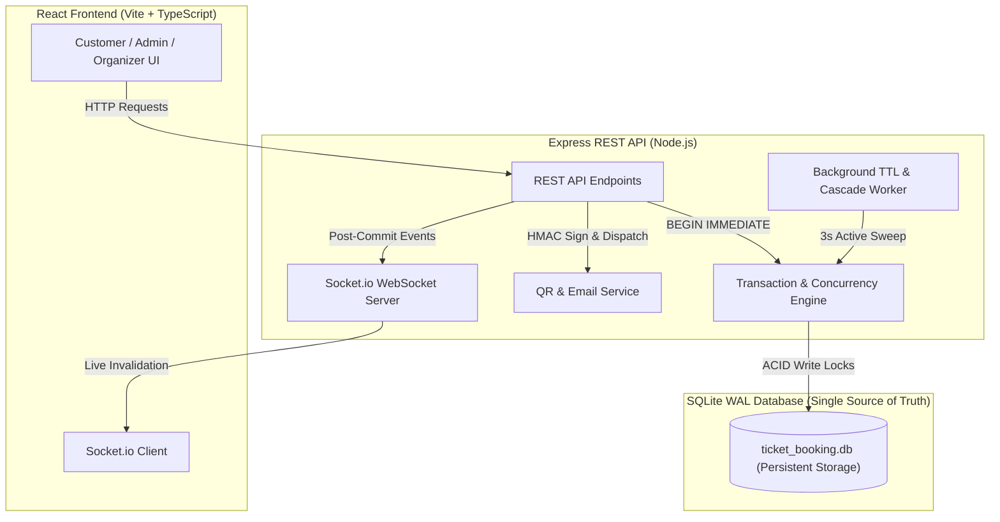

# CineConcert — Next-Gen Ticket Booking Platform (Movies & Concerts)

> A production-grade, full-stack real-time ticket booking platform featuring interactive visual seat maps, strict SQLite `BEGIN IMMEDIATE` concurrency protection, TTL auto-release, automated category-based waitlist cascading, and cryptographic QR code ticketing.

---

## 🌐 Live Demo & Source Code

- **LIVE DEMO**: https://cineconcert.onrender.com
- **SOURCE CODE**: https://github.com/vkDemon1/TicketBooking

---

## Table of Contents
1. [Project Overview](#1-project-overview)
2. [Key Features](#2-key-features)
3. [Architecture & System Flow](#3-architecture--system-flow)
4. [Tech Stack](#4-tech-stack)
5. [Live Demo & Repository Links](#5-live-demo--repository-links)
6. [Folder Structure](#6-folder-structure)
7. [Installation & Setup Guide](#7-installation--setup-guide)
8. [Environment Variables](#8-environment-variables)
9. [Database Schema & Indexes](#9-database-schema--indexes)
10. [Authentication & RBAC](#10-authentication--rbac)
11. [Demo Accounts & Personas](#11-demo-accounts--personas)
12. [REST API Documentation](#12-rest-api-documentation)
13. [Seat States & Authoritative Inventory](#13-seat-states--authoritative-inventory)
14. [Atomic Seat Hold & Locking Logic](#14-atomic-seat-hold--locking-logic)
15. [TTL & Dual Auto-Release System](#15-ttl--dual-auto-release-system)
16. [Concurrency Protection Mechanism](#16-concurrency-protection-mechanism)
17. [Waitlist Auto-Assignment & Cascade](#17-waitlist-auto-assignment--cascade)
18. [QR Code Ticketing, Gate Check-In & Anti-Fraud](#18-qr-code-ticketing-gate-check-in--anti-fraud)
19. [Email System & In-App Mail Sandbox](#19-email-system--in-app-mail-sandbox)
20. [Real-Time WebSockets (Socket.io)](#20-real-time-websockets-socketio)
21. [Automated Testing Suite](#21-automated-testing-suite)
22. [Production Deployment & Persistent Storage](#22-production-deployment--persistent-storage)
23. [Troubleshooting & FAQ](#23-troubleshooting--faq)

---

## 1. Project Overview
CineConcert is an end-to-end ticketing platform for movies and live concert tours. It solves the critical engineering challenges of high-demand ticketing:
- **Zero Double-Booking**: Guarantees strict transactional serialization during simultaneous seat selection spikes (`BEGIN IMMEDIATE`).
- **Seat Map Sync**: Real-time multi-tier seating grids (curved cinema screens and concert stages) synchronizing across all connected browsers.
- **Abandoned Checkout Recovery**: Configurable 10-minute hold TTL with dual expiration (3-second background sweeper + inline lazy check on read).
- **Automated Waitlist Cascade**: On booking cancellation, released seats are automatically assigned to waiting fans with a 5-minute magic claim link; if unclaimed, offers cascade down the queue.
- **Gate Check-In & Anti-Fraud Redemption**: QR tickets signed with HMAC-SHA256, verified at the venue gate with atomic check-in redemption, duplicate entry detection (anti-replay), synthesized Web Audio feedback, and live organizer attendance manifests.

---

## 2. Key Features

### 👑 Admin Portal
- Create and manage venues with custom dimensions (Rows A-Z, 1-40 columns).
- Interactive visual grid builder: Paint seat tiers (`VIP`, `PREMIUM`, `STANDARD`, `BALCONY`, `ACCESSIBLE`) and toggle active/disabled seats.

### 🎪 Organizer Dashboard & Live Gate Monitor
- Create movies and concerts, assign venues, and configure per-category pricing.
- Live box office analytics: Confirmed gross revenue (excluding cancellations), tickets sold, total capacity, and occupancy percentages.
- **Real-Time Gate Attendance Tracking**: Live check-in progress bar per event, attendance rate KPIs, and live **Gate Manifest Inspector** displaying admitted attendees and check-in timestamps in real time.

### 🎟️ Customer Experience
- Browse, search, and filter events by category (Movies / Concerts), city, and date.
- Interactive seat map with hover tooltips, live hold timer, multi-seat selection, and instant price calculation.
- Boarding-pass tickets with print/download support, booking cancellation, and built-in QR ticket scanner.
- Category waitlist subscription for sold-out events with live queue position tracking.

### 🛠️ Evaluator Sandbox & Gate Terminal Tools
- **1-Click Demo Persona Switcher**: Instant switching between Admin, Organizer, Alice (customer with tickets), Bob (Waitlist #1), and Charlie (Waitlist #2).
- **In-App Email Sandbox**: Inspect all delivered confirmation emails, tickets, QR codes, and click magic claim links directly.
- **Staff Gate Terminal & Anti-Fraud Scanner**:
  - Dual modes: **Scan & Check-In** (atomic redemption) vs **Verify Only**.
  - Synthesized Web Audio API sound chimes (harmonic chime on admission, buzzer on double-scan alert).
  - High-visibility badges: 🟢 *Access Granted*, 🟡 *Double Entry Alert (with previous check-in time & gate station)*, 🔴 *Entry Denied*.
  - Live session scan history stream.

---

## 3. Architecture & System Flow



---

## 4. Tech Stack

- **Frontend**: React 18, Vite, TypeScript, Custom Responsive CSS (Dark Cinema Aesthetic, Glassmorphism), Lucide Icons, Canvas Confetti.
- **Backend API**: Node.js, Express, TypeScript.
- **Database**: SQLite with WAL Mode (`PRAGMA journal_mode = WAL;`, `PRAGMA foreign_keys = ON;`, `PRAGMA synchronous = NORMAL;`).
- **Real-Time Layer**: Socket.io (scoped to rooms `event:${eventId}`).
- **Security**: JWT Authentication, bcryptjs password hashing, HMAC-SHA256 QR signatures.
- **Email**: Nodemailer with Ethereal SMTP support and database logging (`email_logs`).
- **Testing**: Vitest, Supertest.
- **Containerization**: Docker multi-stage build, Docker Compose with persistent named volume.

---

## 5. Live Demo & Repository Links

- **LIVE DEMO**:
  https://cineconcert.onrender.com

- **SOURCE CODE**:
  https://github.com/vkDemon1/TicketBooking

---

## 6. Folder Structure

```
TicketBooking/
├── package.json                          # Monorepo scripts (dev, test, seed, build)
├── tsconfig.json
├── .env.example                          # Configuration template
├── Dockerfile                            # Multi-stage production container
├── docker-compose.yml                    # Persistent SQLite volume config
├── README.md                             # 22-section documentation
├── SYSTEM_DESIGN.md                      # Architecture write-up (<= 800 words)
│
├── server/                               # Backend API Service
│   ├── package.json
│   ├── tsconfig.json
│   ├── vitest.config.ts
│   ├── data/                             # SQLite database storage directory
│   │   └── ticket_booking.db
│   ├── src/
│   │   ├── index.ts                      # Express server + Socket.io + Static client
│   │   ├── config/
│   │   │   ├── db.ts                     # SQLite WAL connection & BEGIN IMMEDIATE engine
│   │   │   └── env.ts                    # Typed environment variables
│   │   ├── db/
│   │   │   ├── schema.sql                # SQL DDL tables & indexes
│   │   │   └── seed.ts                   # Demo dataset seed script
│   │   ├── middlewares/
│   │   │   ├── auth.middleware.ts        # JWT verification & RBAC
│   │   │   └── error.middleware.ts       # Centralized error handler
│   │   ├── controllers/
│   │   │   ├── auth.controller.ts        # Register, Login, Demo-login
│   │   │   ├── venue.controller.ts       # Admin venue & layout CRUD
│   │   │   ├── event.controller.ts       # Organizer events & category pricing
│   │   │   ├── booking.controller.ts     # Hold, Release, Checkout, Cancel, Verify
│   │   │   └── waitlist.controller.ts    # Join waitlist, Inspect & Claim offer
│   │   ├── services/
│   │   │   ├── hold-sweeper.service.ts   # 3s background sweeper & lazy expiry
│   │   │   ├── waitlist.service.ts       # Oldest-satisfiable cascade algorithm
│   │   │   ├── qr.service.ts             # HMAC signer & QR code builder
│   │   │   ├── email.service.ts          # Post-commit Nodemailer engine
│   │   │   └── socket.service.ts         # Room-scoped WebSocket broadcaster
│   │   ├── routes/
│   │   │   ├── auth.routes.ts
│   │   │   ├── venue.routes.ts
│   │   │   ├── event.routes.ts
│   │   │   ├── booking.routes.ts
│   │   │   ├── waitlist.routes.ts
│   │   │   └── sandbox.routes.ts
│   │   └── utils/
│   │       ├── errors.ts                 # Custom HttpError classes
│   │       └── logger.ts
│   └── tests/
│       ├── concurrency.test.ts           # 20 simultaneous seat hold race test
│       ├── ttl.test.ts                   # 2s TTL auto-release & lazy expiry test
│       ├── waitlist.test.ts              # Waitlist auto-assignment, expiry & cascade test
│       ├── booking-concurrency.test.ts   # Duplicate checkout race test
│       ├── qr.test.ts                    # QR HMAC verification & cancellation test
│       ├── gate-checkin.test.ts          # Gate check-in, duplicate scan 409 & concurrency test
│       └── sandbox-waitlist-magic.test.ts# E2E waitlist magic claim & scan flow test
│
└── client/                               # Frontend Single Page Application
    ├── package.json
    ├── vite.config.ts
    ├── index.html
    ├── src/
    │   ├── main.tsx
    │   ├── App.tsx                       # Client router & persona banner
    │   ├── index.css                     # Modern dark theme styling
    │   ├── types/                        # TypeScript domain models
    │   ├── context/
    │   │   ├── AuthContext.tsx           # Session management & demo switcher
    │   │   └── SocketContext.tsx         # Live WebSocket connection
    │   ├── components/
    │   │   ├── layout/                   # Navbar, Footer, DemoSwitcher
    │   │   ├── seatmap/                  # SeatMap, SeatLegend, HoldTimer
    │   │   ├── tickets/                  # Boarding-pass TicketCard
    │   │   ├── waitlist/                 # WaitlistModal
    │   │   ├── sandbox/                  # EmailSandboxModal, QRScannerModal
    │   │   └── common/                   # AuthModal
    │   └── pages/
    │       ├── HomePage.tsx              # Event discovery & filters
    │       ├── EventDetailsPage.tsx      # Seat map & checkout sidebar
    │       ├── MyBookingsPage.tsx        # Booking history & queue tracking
    │       ├── ClaimOfferPage.tsx        # Magic link waitlist claim page
    │       ├── AdminVenuesPage.tsx       # Venue designer & layout builder
    │       └── OrganizerDashboardPage.tsx# Confirmed revenue analytics
```

---

## 7. Installation & Setup Guide

### Prerequisites
- Node.js (v18.0.0 or higher)
- npm (v9.0.0 or higher)

### 1. Clone & Install Dependencies
```bash
git clone https://github.com/vkDemon1/TicketBooking.git
cd TicketBooking

# Install root, server, and client dependencies
npm run setup
```

### 2. Seed Database with Demo Data
```bash
npm run seed
```

### 3. Start Full-Stack Application
```bash
npm run dev
```
- **Client**: [http://localhost:5173](http://localhost:5173)
- **Backend API**: [http://localhost:5000](http://localhost:5000)

---

## 8. Environment Variables

Configure environment variables in `.env` (or copy `.env.example`):

```ini
# Server Configuration
PORT=5000
NODE_ENV=development
CLIENT_URL=http://localhost:5173

# Database Location
DB_PATH=./data/ticket_booking.db

# Security Secrets (Separate keys for JWT and QR signing)
JWT_SECRET=super_secret_jwt_key_ticket_platform_2026
QR_SECRET=super_secret_qr_hmac_key_ticket_platform_2026

# Feature Flags
ENABLE_DEMO_LOGIN=true

# Seat Hold & Waitlist Expiry Settings (in seconds)
HOLD_TTL_SECONDS=600
WAITLIST_OFFER_TTL_SECONDS=300

# Email Delivery (Ethereal SMTP auto-generated if empty)
SMTP_HOST=smtp.ethereal.email
SMTP_PORT=587
SMTP_USER=
SMTP_PASS=
SMTP_FROM=tickets@cineconcert.io
```

---

## 9. Database Schema & Indexes

The database uses SQLite in WAL mode with foreign keys enabled. `event_seats` is the authoritative single source of truth for seat status.

### Tables (`server/src/db/schema.sql`)
1. `users`: `(id, email, password_hash, name, role [ADMIN, ORGANIZER, CUSTOMER], created_at)`
2. `venues`: `(id, name, address, city, type [CINEMA, CONCERT_HALL, STADIUM], rows, cols, created_at)`
3. `seats`: `(id, venue_id, row_label, seat_number, category, is_active, UNIQUE(venue_id, row_label, seat_number))`
4. `events`: `(id, organizer_id, venue_id, title, description, category, banner_url, date_time, duration_mins, status, created_at)`
5. `event_seat_pricing`: `(id, event_id, seat_category, price, UNIQUE(event_id, seat_category))`
6. `event_seats`: `(id, event_id, seat_id, status [AVAILABLE, HELD, BOOKED, WAITLIST_HELD], current_hold_id, updated_at, UNIQUE(event_id, seat_id))`
7. `seat_holds`: `(id, event_id, user_id, seat_ids_json, expires_at, status [ACTIVE, CONVERTED, EXPIRED, RELEASED], created_at)`
8. `bookings`: `(id, booking_reference, event_id, user_id, total_amount, status [CONFIRMED, CANCELLED], qr_payload, qr_signature, created_at)`
9. `booking_seats`: `(id, booking_id, seat_id, price_paid)`
10. `waitlist_entries`: `(id, event_id, user_id, seat_category, seat_count, status [WAITING, OFFERED, CONVERTED, EXPIRED, CANCELLED], created_at)`
11. `waitlist_offers`: `(id, waitlist_entry_id, event_id, user_id, seat_ids_json, claim_token, expires_at, status [PENDING, ACCEPTED, EXPIRED], created_at)`
12. `email_logs`: `(id, to_email, subject, template, data_json, status, error_message, sent_at)`

### Performance Indexes
- `idx_event_seats_event_status`: `event_seats(event_id, status)`
- `idx_seat_holds_active_exp`: `seat_holds(event_id, status, expires_at)`
- `idx_waitlist_active_queue`: `waitlist_entries(event_id, seat_category, status, created_at)`
- `idx_waitlist_offers_pending_exp`: `waitlist_offers(status, expires_at)`
- `idx_bookings_user`: `bookings(event_id, user_id)`
- `idx_bookings_reference`: `bookings(booking_reference)`

---

## 10. Authentication & RBAC

- **Customer Registration**: Public registration `POST /api/auth/register` strictly creates `CUSTOMER` accounts.
- **JWT Tokens**: Signed using `JWT_SECRET` with user payload `(userId, email, role, name)`.
- **Role Middleware**:
  - `requireAuth`: Validates JWT token.
  - `requireRole(['ADMIN'])`: Restricts venue creation and layout management to administrators.
  - `requireRole(['ORGANIZER', 'ADMIN'])`: Restricts event creation and box office analytics.
- **Ownership Verification**: Backend middleware strictly validates that organizers can only view their own events and customers can only view/cancel their own bookings and waitlist entries.

---

## 11. Demo Accounts & Personas

All pre-seeded demo accounts use password: `password123`.

| Persona | Role | Email | Scenario & Purpose |
|---|---|---|---|
| **Alex Vance** | `ADMIN` | `admin@cineconcert.io` | Manage venues, test layout designer & seat tiers |
| **Apex Live** | `ORGANIZER` | `organizer@cineconcert.io` | View confirmed box office revenue, publish shows |
| **Alice Walker** | `CUSTOMER` | `alice@cineconcert.io` | Holds confirmed booking for *Interstellar VIP seats A1-A2* |
| **Bob Martinez** | `CUSTOMER` | `bob@cineconcert.io` | #1 on Waitlist for Interstellar VIP (2 seats) |
| **Charlie Davis** | `CUSTOMER` | `charlie@cineconcert.io` | #2 on Waitlist for Interstellar VIP (1 seat) |

---

## 12. REST API Documentation

### Authentication (`/api/auth`)
- `POST /api/auth/register` — Register customer account (`{ name, email, password }`).
- `POST /api/auth/login` — Login with credentials (`{ email, password }`).
- `GET /api/auth/me` — Return current authenticated session.
- `POST /api/auth/demo-login` — Fast evaluator persona switcher (`{ role, email? }`).

### Venues & Layouts (`/api/venues`)
- `GET /api/venues` — List all venues.
- `GET /api/venues/:id` — Get venue details with seat grid.
- `POST /api/venues` [ADMIN] — Create venue with custom dimensions and seat tiers.
- `PUT /api/venues/:id/seats` [ADMIN] — Bulk update seat categories and active states.

### Events & Seat Map (`/api/events`)
- `GET /api/events` — List published events with search, category, city, and date filters.
- `GET /api/events/:id` — Event details and category pricing.
- `GET /api/events/:id/seats` — Visual seat map (triggers read-optimized lazy expiration inline).
- `POST /api/events` [ORGANIZER] — Create event and initialize `event_seats`.
- `GET /api/events/organizer/my-events` [ORGANIZER] — Live revenue and occupancy analytics.

### Holds & Booking (`/api/bookings`)
- `POST /api/bookings/hold` — Atomically place hold with configurable TTL (`{ eventId, seatIds, ttlSeconds }`).
- `POST /api/bookings/release-hold` — Manually release hold on checkout abandonment (`{ holdId }`).
- `POST /api/bookings/checkout` — Atomically convert active hold to confirmed booking (`{ holdId }`).
- `GET /api/bookings/my-bookings` — Customer booking history with QR codes.
- `POST /api/bookings/:id/cancel` — Cancel booking and trigger waitlist auto-assignment.
- `GET /api/bookings/verify/:bookingReference` — **Canonical verification endpoint** (supports optional `?signature=...` query param).

### Waitlist (`/api/waitlist`)
- `POST /api/waitlist/join` — Join category queue (`{ eventId, seatCategory, seatCount }`).
- `GET /api/waitlist/my-entries` — User's active waitlist positions and pending offers.
- `GET /api/waitlist/offer/:token` — Inspect time-limited offer by magic token.
- `POST /api/waitlist/claim` — Atomically claim offer and convert to confirmed booking (`{ token }`).

### Sandbox (`/api/sandbox`)
- `GET /api/sandbox/emails` — Inspect logged ticket emails, QR payloads, and magic claim links.

---

## 13. Seat States & Authoritative Inventory

The `event_seats` table is the single source of truth for seat status:

| State | Color Indicator | Meaning |
|---|---|---|
| `AVAILABLE` | Emerald Green | Unreserved seat. Click to select. |
| `HELD` | Amber / Padlock | Temporarily reserved by a fan during checkout (10m TTL). |
| `BOOKED` | Crimson Red / X | Confirmed purchased seat. |
| `WAITLIST_HELD` | Cyan Blue / Users | Reserved for an eligible waitlist fan awaiting claim (5m TTL). |

---

## 14. Atomic Seat Hold & Locking Logic
1. Hold requests execute inside a `db.transaction(...).immediate(...)` call.
2. The transaction acquires an exclusive write lock immediately at `BEGIN IMMEDIATE`.
3. Lazy-expires any stale holds for the event inline.
4. Verifies every requested seat belongs to the event and is strictly `AVAILABLE`.
5. Inserts `seat_holds` record with `expires_at = NOW() + HOLD_TTL_SECONDS`.
6. Updates `event_seats` status to `HELD` and links `current_hold_id`.
7. Upon commit, broadcasts `SEATS_HELD` via Socket.io.

---

## 15. TTL & Dual Auto-Release System
The platform implements **dual-engine expiry**:
- **3-Second Background Sweeper**: Scans active holds where `expires_at <= CURRENT_TIMESTAMP`, reverts `event_seats` to `AVAILABLE`, marks hold `EXPIRED`, and emits `SEATS_RELEASED`.
- **Read-Optimized Lazy Expiration**: Checks for expired holds inline during `GET /api/events/:id/seats` or before new hold attempts, guaranteeing that stale holds never block incoming customers.

---

## 16. Concurrency Protection Mechanism
When 20 users simultaneously request the exact same seat:
- SQLite's serialized transaction lock ensures only the first request executes the `AVAILABLE -> HELD` transition.
- The remaining 19 transactions read the updated `HELD` status, rollback, and receive `HTTP 409 Conflict`.
- Verified via the automated concurrency test: `npm run test:concurrency`.

---

## 17. Waitlist Auto-Assignment & Cascade
- **Queue Policy**: Category-based ordered queue with oldest-satisfiable allocation.
- When seats of category $C$ are released upon cancellation:
  1. The engine iterates through `WAITING` entries in timestamp order (`created_at ASC`).
  2. If an entry requests $N \le \text{released count}$, it receives an exclusive 5-minute `waitlist_offers` token, entry becomes `OFFERED`, and seats transition directly to `WAITLIST_HELD`.
  3. If an older entry requests more seats than available, it is not partially split; the engine skips to subsequent entries in the queue that can be fully satisfied.
  4. If an offer expires unclaimed, the 3-second sweeper marks it `EXPIRED` and immediately cascades the seats to the next eligible customer in line.

---

## 18. QR Code Ticketing & Cryptographic Security
- QR codes encode `{ "bookingReference": "BK-...", "signature": "..." }` without exposing private customer PII.
- The signature is calculated using `HMAC-SHA256(bookingReference, QR_SECRET)`.
- Verification endpoint `GET /api/bookings/verify/:bookingReference` performs timing-safe comparison and checks booking status:
  - `CONFIRMED` $\rightarrow$ `VALID` (Admission granted).
  - `CANCELLED` $\rightarrow$ `CANCELLED` (Admission denied).
  - Forged / tampered signature $\rightarrow$ `INVALID`.

---

## 19. Email System & In-App Mail Sandbox
- Delivered via Nodemailer with Ethereal SMTP support.
- Dispatched strictly **after** database transactions commit.
- Every email is recorded in `email_logs`.
- The in-app **Mail Sandbox** allows evaluators to view tickets, inspect QR codes, and click magic claim links in real time.

---

## 20. Real-Time WebSockets (Socket.io)
- Clients join room `event:${eventId}` when viewing an event.
- Broadcasts lightweight invalidation signals (`SEATS_HELD`, `SEATS_RELEASED`, `SEATS_BOOKED`, `WAITLIST_OFFER_CREATED`).
- SQLite is the single source of truth; clients re-fetch fresh state from the REST API on reconnect.

---

## 21. Automated Testing Suite

Run all tests from the repository root:
```bash
npm test
```

Verified Test Results: **5 test files passed, 11/11 tests passed (100%)**.

### Dedicated Test Commands:
```bash
# 1. Concurrency Stress Test (20 simultaneous requests -> 1 HTTP 200, 19 HTTP 409)
npm run test:concurrency

# 2. TTL Auto-Release & Lazy Expiry Test (2-second TTL deterministic test)
npm run test:ttl

# 3. Waitlist Cascade & Expiry Test (Cancellation -> Offer -> Expiry -> Cascade -> Claim)
npm run test:waitlist

# 4. Booking Concurrency Test (Simultaneous duplicate checkout protection)
npm run test:booking

# 5. QR Cryptographic Verification Test (Valid, Forged, and Cancelled QR tickets)
npm run test:qr
```

---

## 22. Production Deployment & Persistent Storage

### Live Render Deployment
- **Deployment Type**: CineConcert is deployed as a Docker Web Service on Render.
- **Live URL**: https://cineconcert.onrender.com
- **Database Engine**: The application uses SQLite (`/app/server/data/ticket_booking.db` inside the container).
- **Free Instance Notice**: The current hosted demonstration runs on Render's Free instance without an attached persistent disk. In a production environment, a persistent disk/volume would be required for persistent SQLite storage across container restarts and redeployments.

### Local Docker Deployment
```bash
# Build and run with persistent volume mount for SQLite:
docker-compose up --build -d
```
The application will be live at `http://localhost:5000`.

### Production Cloud Hosting Persistence Strategy (Render / Railway / Fly.io)
For a persistent production deployment requiring SQLite data retention across restarts:
1. **Render (Production)**:
   - Deploy as a **Web Service** using Docker runtime.
   - Attach a **Persistent Disk** mounted at `/app/server/data` (Size: 1GB+).
   - Set environment variables: `PORT=5000`, `NODE_ENV=production`, `JWT_SECRET=...`, `QR_SECRET=...`, `DB_PATH=/app/server/data/ticket_booking.db`.
2. **Railway / Fly.io (Production)**:
   - Configure a persistent volume mounted to `/app/server/data` to ensure SQLite survives container restarts and redeployments.

---

## 23. Troubleshooting & FAQ

- **Database Locks**: SQLite in WAL mode allows concurrent readers while serialized `BEGIN IMMEDIATE` writes prevent write starvation.
- **Port Conflicts**: Change `PORT` in `.env` if 5000 is occupied.
- **Resetting Demo Data**: Run `npm run seed` at any time to restore the initial test state.

