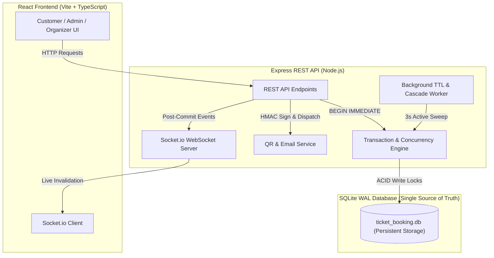

# System Design Document: CineConcert Ticket Booking Platform

## 1. Executive Summary & Architecture
CineConcert is a high-concurrency ticket booking platform for movies and concerts built with React 18, Node.js/Express, TypeScript, Socket.io, and SQLite in WAL mode. The SQLite database serves as the **single source of truth** for all seat states, utilizing serialized transaction write locks (`BEGIN IMMEDIATE`) to strictly guarantee ACID consistency without distributed race conditions.



---

## 2. Seat Hold & TTL Mechanism
When a customer selects seats, the system initiates an atomic reservation with a configurable Time-To-Live (TTL) (default: 600s / 10 mins).

The platform implements a **dual-expiry architecture**:
1. **Active 3-Second Background Sweeper**: A lightweight worker runs every 3 seconds, querying active holds where `expires_at <= CURRENT_TIMESTAMP`. In a single `BEGIN IMMEDIATE` transaction, expired holds transition to `EXPIRED`, their associated `event_seats` revert from `HELD` to `AVAILABLE`, and a `SEATS_RELEASED` event is broadcast via Socket.io.
2. **Read-Optimized Lazy Expiration**: Before serving `GET /api/events/:id/seats` or processing a new hold attempt, an inline query checks for expired holds on that event and purges them immediately. This ensures stale holds never block incoming requests even during timer micro-delays.

---

## 3. Concurrency Protection & Serialization
Preventing double-booking during simultaneous reservation attempts is enforced at the database transaction boundary:

```sql
BEGIN IMMEDIATE;
-- 1. Query requested seat states for the event
-- 2. Verify EVERY requested seat has status == 'AVAILABLE'
-- 3. If any seat is HELD, BOOKED, or WAITLIST_HELD -> ROLLBACK & return HTTP 409 Conflict
-- 4. Insert seat_holds record (status: 'ACTIVE')
-- 5. Update event_seats status to 'HELD' and set current_hold_id
-- 6. COMMIT
```

`BEGIN IMMEDIATE` guarantees that the first transaction acquires an exclusive write lock immediately. Any simultaneous thread attempting to reserve the same seat is blocked until commit and then receives an `HTTP 409 Conflict` error upon reading the updated `HELD` status. Conversion to confirmed booking (`POST /api/bookings/checkout`) is equally protected: validating hold ownership, expiry, and active status inside a single transaction before transitioning seats to `BOOKED`.

---

## 4. Waitlist Queue & Auto-Assignment Flow
When popular shows sell out, customers join an event waitlist for specific seat categories (`VIP`, `PREMIUM`, `STANDARD`, `BALCONY`).

### Allocation Policy
The engine implements a **Category-based ordered queue with oldest-satisfiable allocation**:
- Entries are ordered strictly by `created_at ASC` per `(event_id, seat_category)`.
- When $M$ seats of a category are released upon booking cancellation:
  - The queue is evaluated in timestamp order.
  - If a user requests $N \le M$ seats, $N$ seats are allocated, a time-limited `waitlist_offers` record is generated with a unique `claim_token`, the entry transitions to `OFFERED`, and the seats transition to `WAITLIST_HELD`.
  - If an older entry requests $N > M$ seats, it is **not partially satisfied**; the engine advances to subsequent entries in the queue that can be fully satisfied.
  - Any remaining unallocated seats revert to `AVAILABLE`.

---

## 5. Time-Limited Offer Handling & Cascading
Waitlist offers carry an exclusive 5-minute TTL (`WAITLIST_OFFER_TTL_SECONDS`).

1. **Offer Notification**: Once the cancellation transaction commits, an email is dispatched containing a magic checkout URL (`/events/:id/claim?token=...`).
2. **Atomic Claim**: Visiting the magic link and confirming initiates a `BEGIN IMMEDIATE` transaction that validates token validity, user session match, and `WAITLIST_HELD` seat state before creating the booking and transitioning seats to `BOOKED`.
3. **Automated Expiry Cascade**: If the customer fails to claim within 5 minutes, the background sweeper marks the offer `EXPIRED` and **automatically cascades** the released seats to the next eligible customer in the waitlist queue.

---

## 6. Security, Gate Check-In & Real-Time Sync
- **Cryptographic QR Code**: Encodes `{ "bookingReference": "BK-...", "signature": "..." }` generated using `HMAC-SHA256(bookingReference, QR_SECRET)`. No raw customer PII is stored in the QR payload.
- **Verification & Gate Check-In**: `GET /api/bookings/verify/:bookingReference` performs timing-safe signature comparison and database validation, returning `VALID`, `REDEEMED`, `CANCELLED`, or `INVALID`.
- **Atomic Gate Redemption (`POST /api/bookings/check-in`)**: Inside a `BEGIN IMMEDIATE` transaction, verifies `status == 'CONFIRMED'` and `is_redeemed == 0` before updating `is_redeemed = 1`, `redeemed_at = NOW()`, and `redeemed_by = [Gate Staff]`. Re-scanning an already redeemed ticket immediately returns `HTTP 409 Conflict` (`ALREADY_REDEEMED`) with the exact timestamp and station of prior admission to prevent duplicate entry fraud.
- **Real-Time WebSockets**: Socket.io rooms (`event:${eventId}`) broadcast invalidation events (`SEATS_HELD`, `SEATS_RELEASED`, `SEATS_BOOKED`, `TICKET_REDEEMED`). Connected clients and gate terminals refresh their visual grids and attendance manifests instantly without polling.

---

## 7. Storage Persistence & Deployment
For cloud deployment (Render, Railway, Docker), SQLite data is mapped to a dedicated **Persistent Volume** at `/app/server/data/ticket_booking.db` with WAL mode enabled, guaranteeing zero data loss across container rebuilds and restarts.
